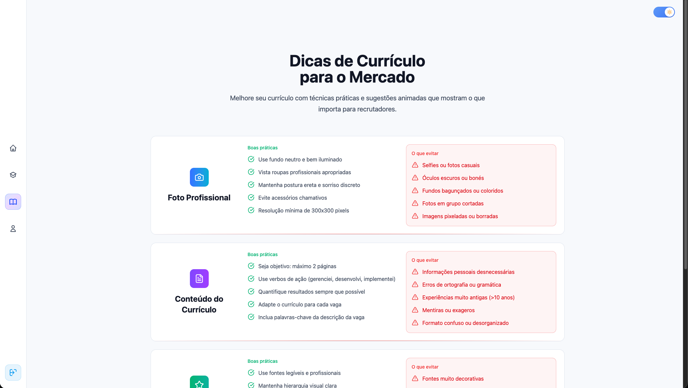
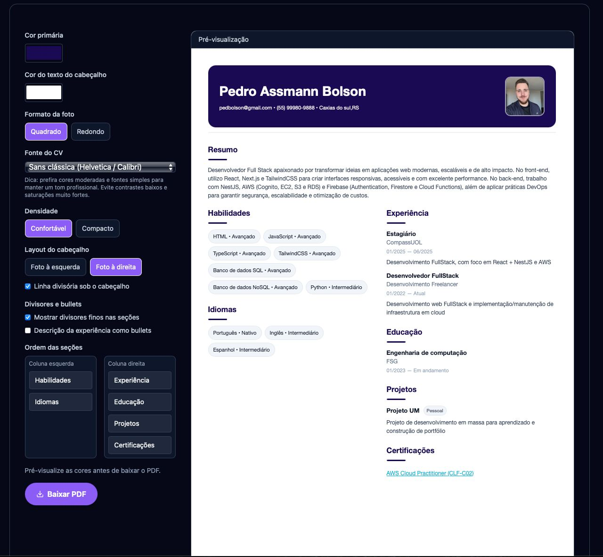

# Itinerário Extensionista 01


> Plataforma web que entrega mini cursos com acompanhamento de progresso, portal administrativo e um gerador de currículo visual com exportação em PDF. O backend roda em Google Apps Script sobre planilhas do Google Drive, permitindo operação sem infraestrutura dedicada.

## Índice

1. [Visão geral](#visão-geral)
2. [Screenshots](#screenshots)
3. [Stack principal](#stack-principal)
4. [Arquitetura](#arquitetura)
5. [Funcionalidades](#funcionalidades)
6. [Fluxos críticos e segurança](#fluxos-críticos-e-segurança)
7. [Execução local](#execução-local)
8. [Configuração do backend (Apps Script)](#configuração-do-backend-apps-script)
9. [Variáveis de ambiente do front-end](#variáveis-de-ambiente-do-front-end)
10. [Estrutura de pastas](#estrutura-de-pastas)
11. [Scripts npm](#scripts-npm)
12. [Convenções e tooling](#convenções-e-tooling)
13. [Roadmap](#roadmap)
14. [Contato](#contato)

## Visão geral

- SPA em React + TypeScript com roteamento público (landing, tutorial, cursos, gerador de currículo) e rotas protegidas para o painel administrativo.
- Dados mestres e autenticação ficam em uma planilha do Google. O script `google-apps-script/Code.gs` expõe uma API REST segura com schema versionado, migração automática de cabeçalhos, rate limiting, nonce e reCAPTCHA opcional.
- O front-end mantém um store em memória (`src/lib/memoryStore.ts`) e sincroniza tudo via `src/lib/remoteSync.ts`, oferecendo experiência offline-first para os dados públicos e cache local do progresso individual.
- O player de aulas (`YouTube Iframe API`) registra progresso com salvamento incremental (cada 10s) e reconecta automaticamente na próxima sessão.

## Screenshots

<p align="center">
  
  
  
</p>

## Stack principal

| Camada | Principais ferramentas |
|--------|------------------------|
| Front-end | React 19, TypeScript, Vite, Tailwind CSS 4, Framer Motion |
| UI/UX | `@hello-pangea/dnd` para drag & drop, lucide-react para ícones, React Datepicker e date-fns |
| PDF | html2canvas + jsPDF com renderização fiel do preview |
| Estado & dados | Context API (`AuthContext`, `LearnerContext`), store em memória, caches em `localStorage` |
| Backend | Google Apps Script + Sheets (`SCHEMA`, validações, LockService) |
| Segurança | Sessões opacas com Script Properties, senha HMAC-SHA256 com salt, anti-bot (captcha + desafio aritmético), throttling via CacheService |

## Arquitetura

### Front-end

- `src/App.tsx` organiza rotas via React Router (landing pages e rotas `/dashboard` protegidas por `ProtectedRoute`).
- Contextos principais:
  - `AuthContext` (`src/context/AuthContext.tsx`): autenticação baseada na API do Apps Script, com desafio extra após repetidas tentativas.
  - `LearnerContext` (`src/context/LearnerContext.tsx`): controla participante ativo, progresso e fluxo de atualização em tempo real.
- `src/lib/remoteStore.ts` encapsula a comunicação HTTP com o Apps Script, gerenciando sessão (`sessionToken`), nonce e chave secreta (`VITE_REMOTE_API_SECRET`).
- `src/lib/remoteSync.ts` baixa snapshots completos (`dump`), normaliza tipos, importa para o store em memória e usa `cache.ts` para guardar tópicos/ conteúdos/ aulas de forma pública.
- `src/lib/progress.ts` gerencia toda a lógica de participantes: criação de códigos, salvamento incremental de progresso, merge com dados do servidor e cache local (`progressCache.ts`).
- `DashboardPage` usa drag & drop para ordenar e persistir `order` de tópicos, conteúdos e lições. Após qualquer alteração chama `hydrateFromRemote()` para garantir convergência com o backend.
- `ResumeForm` + `ResumePreview` implementam o gerador WYSIWYG. O formulário multipasso suporta reordenação de seções, personalização de tema e exportação em PDF sem depender do backend.

### Backend (Apps Script + Google Sheets)

- `google-apps-script/Code.gs` define o schema das abas: `users`, `topics`, `contents`, `lessons`, `participants`. Cada campo tem header fixo e validador (`SCHEMA.validators`) garantindo integridade antes de gravar na planilha.
- `ensureCurrentHeaders` migra cabeçalhos legados para o novo padrão (tradução pt-BR) sem perda de dados. A função utilitária `ensureSchemaNonDestructive` pode ser executada manualmente para alinhar layout/ validações na planilha.
- Autenticação:
  - `auth_login` consulta planilha de usuários, valida `passwordHash` (HMAC-SHA256 com salt aleatório) e cria sessão de 8 horas (`ScriptProperties`).
  - `auth_logout` remove a sessão e `auth_change_password` exige nonce + revalidação da senha atual.
- CRUD genérico:
  - `create`, `update`, `upsert`, `batch_upsert`, `delete` funcionam para qualquer tabela descrita no `SCHEMA`.
  - `FIELD_MAP` traduz automaticamente entre chaves antigas (ex: `topicId`) e o padrão interno (`topicoId`), simplificando compatibilidade.
  - `users` têm regras restritivas: apenas administradores podem criar/remover; usuários padrão só trocam a própria senha.
  - `participants` aceitam `batch_upsert` sem nonce (registro público). Dados brutos de progresso são armazenados como JSON compactado.
- Segurança complementar: validação por segredo (`API_SECRET` via query/header), optional reCAPTCHA (`RECAPTCHA_SECRET`), nonce por requisição de escrita, limitação 300 requisições/5 min por IP e lock de 30s (`LockService`) para evitar race conditions.

#### Ações disponíveis

| Endpoint | Método | Ação (`action`) | Descrição resumida |
|----------|--------|-----------------|--------------------|
| `/exec`  | GET    | `dump`          | Retorna snapshot completo (users sanitizados, tópicos, conteúdos, aulas, participantes) |
| `/exec`  | GET    | `list`          | Lista registros paginados por tabela, com filtro `field=...&eq=...` |
| `/exec`  | GET    | `get`           | Busca registro por ID/código |
| `/exec`  | GET    | `nonce`         | Gera nonce obrigatório para ações de escrita (exceto batch de participantes) |
| `/exec`  | POST   | `auth_*`        | Fluxos de login/logout/troca de senha |
| `/exec`  | POST   | `create`/`update`/`upsert`/`batch_upsert`/`delete` | CRUD genérico; valida esquema antes da gravação |

### Sincronização e cache

- `memoryStore` mantém uma cópia reativa dos dados. Listeners (`subscribeTopics`, `subscribeLessons`, `subscribeProgress` etc.) alimentam hooks como `useRealtimeData`.
- Conteúdo público (tópicos/ cursos/ aulas) é salvo em `localStorage` com TTL de 5 minutos (`cache.ts`), acelerando renderização inicial.
- Progresso por participante é versionado e armazenado individualmente (`progressCache.ts`). Atualizações locais são marcadas como "dirty" e sincronizadas em background com debounce (1,5s) ou imediatamente quando o usuário deixa a página.
- `YouTubePlayer` reconstrói o tempo assistido a partir do cache local e dispara `saveLessonProgress` a cada 10 segundos ou em eventos chave (pausa, término).

### Estrutura das planilhas

| Aba | Chave primária | Principais campos |
|-----|----------------|-------------------|
| `users` | `id` | `email`, `nomeCompleto`, `perfil` (`admin`/`user`), `ativo`, `hashSenha`, `criadoEm`, `atualizadoEm` |
| `topics` | `id` | Nome, categoria, cor, `ordem`, capa (`imagemCapaUrl`/`imagemCapaAlt`) |
| `contents` | `id` | Relaciona `topicoId`, título, descrição, capa, dificuldade, `ordem` |
| `lessons` | `id` | Relaciona `conteudoId`, título, URL do YouTube, descrição, `ordem` |
| `participants` | `codigo` | Nome, dados familiares, casa de acolhimento, progresso serializado (`progressoAulas`) |

## Funcionalidades

### Para participantes
- Landing com overview dos serviços, tutorial com boas práticas de currículo e acesso rápido ao gerador de CV.
- Navegação por mini cursos com filtros, busca, estatísticas de conclusão e player integrado.
- Autenticação simplificada por código: `LearnerAccess` valida o código, ativa o participante e carrega progresso.
- Progresso salvo automaticamente com indicadores percentuais e histórico das aulas concluídas.

### Portal administrativo
- Login com desafio anti-bot após múltiplas falhas.
- Dashboard para criar/editar tópicos, cursos e aulas (drag & drop com persistência da ordem).
- Pré-visualização de aulas com player, metadados e botões de ação rápidos.
- Gestão de participantes: busca, ordenação por atividade, cadastro/edição de perfil (idade, família, casa), exclusão segura.
- Modal de usuários para admins: CRUD de contas, promoção para administrador, ativação/desativação, reset de senha com dupla checagem.

### Gerador de currículos
- Formulário multipasso (dados pessoais, experiência, educação, habilidades, idiomas, projetos, certificações).
- Customização de layout: tema de cores, fontes, densidade, forma da foto, divisórias e ordenação das seções em duas colunas.
- Preview em tempo real (componente `ResumePreview`) exibido lado a lado e replicado em um canvas oculto para exportação PDF com jsPDF + html2canvas.
- Upload opcional de foto, validação de datas (DatePicker com locale pt-BR), autoformatação de telefones e textos.

### Experiência & UI
- Tema claro/escuro persistente via `ThemeSwitch` + `useTheme`.
- Microinterações com Framer Motion em cards, botões do nav, banners de feedback e tooltips (`InstantTooltip`).
- Layouts responsivos (Tailwind tokens com classes semânticas `bg-theme-*`, `text-theme-*`, etc.).
- Indicadores de atualização (`RealtimeIndicator`) informam sincronizações em background.
- Instalável como PWA (manifesto dedicado, ícones e service worker com cache básico).

## Fluxos críticos e segurança

- **Autenticação**: sessão opaca (`sessionToken`) emitida pelo Apps Script, armazenada apenas em memória. Renovada a cada login e utilizada em chamadas subsequentes.
- **Controle de acesso**:
  - Admins gerenciam tudo (usuários, conteúdos, participantes).
  - Usuários padrão podem apenas alterar a própria senha.
  - Participantes podem ser criados/atualizados sem autenticação completa (cadeia pública controlada por segredo + nonce).
- **Proteção anti-abuso**:
  - API exige `API_SECRET` (query string ou header).
  - Nonce obrigatório para ações de escrita (exceto `participants.batch_upsert`).
  - Rate limit via CacheService (`hitLimit`) e LockService para evitar concorrência.
  - Desafio aritmético adicional no login front-end após 5 tentativas e reCAPTCHA opcional no backend.
- **Integridade de dados**:
  - Validação por tipo/tamanho em todos os campos.
  - Migração automática de cabeçalhos legados oculta diferenças entre `snake_case`/`camelCase`.
  - Hash de senha com salt exclusivo por usuário.
- **Offline-friendly**:
  - Conteúdo público carrega de cache instantaneamente enquanto a sincronização completa roda em background.
  - Progresso individual persiste no navegador e é sincronizado assim que a conexão volta.

## Execução local

1. Pré-requisitos: Node.js 18 ou superior e npm.
2. Instale dependências:
   ```bash
   npm install
   ```
3. Configure `.env.local` (ver seção [Variáveis](#variáveis-de-ambiente-do-front-end)).
4. Inicie o modo desenvolvimento (porta 5173 por padrão):
   ```bash
   npm run dev
   ```
   - O Vite está configurado para proxyar `/api` para o Apps Script (ver `vite.config.ts`). Para testar localmente, deixe `VITE_REMOTE_BASE_URL=/api`.
5. Build de produção e preview:
   ```bash
   npm run build
   npm run preview
   ```

## Deploy automatizado (GitHub Pages)

- Qualquer push na branch `gitpages` dispara o workflow `.github/workflows/deploy.yml`.
- O pipeline executa `npm ci`, `npm run build` e publica o conteúdo da pasta `dist/` na branch `gh-pages` usando `peaceiris/actions-gh-pages`.
- Configure o GitHub Pages para servir a partir da branch `gh-pages` (diretório raiz). Recomenda-se apontar o backend (CORS) para a URL final do Pages.
- Caso o front dependa de variáveis sensíveis (`VITE_REMOTE_BASE_URL`, `VITE_REMOTE_API_SECRET`), crie **Repository Secrets** ou **Variables** com esses nomes para que o build de produção use os valores corretos.

## Configuração do backend (Apps Script)

1. **Planilha**: crie uma planilha com abas `users`, `topics`, `contents`, `lessons`, `participants`. Pode ser vazia.
2. **Código**: abra _Extensões → Apps Script_, substitua o conteúdo por `google-apps-script/Code.gs`.
3. **Propriedades do script** (_Project Settings → Script properties_):
   - `API_SECRET`: string longa compartilhada com o front-end.
   - `ALLOWED_ORIGIN`: origem autorizada (ex.: `https://seu-dominio.com`). Usada para validações customizadas no front-end.
   - `RECAPTCHA_SECRET` (opcional): segredo do reCAPTCHA v3 se desejar ativar.
   - `SESSION_TTL_SEC` pode ser ajustado diretamente no código se necessário.
4. **Ajuste de schema**: execute manualmente `ensureSchemaNonDestructive()` (menu _Executar_). Isso corrige cabeçalhos, formatação de datas e validações (checkbox `ativo`, lista de `perfil`).
5. **Deploy**: _Deploy → New deployment → Web app_:
   - App type: `Web app`
   - Who has access: `Anyone`
   - URL gerada será usada como base (`https://script.google.com/macros/s/.../exec`).
6. **Proxy local**: em desenvolvimento, o `vite.config.ts` já redireciona `/api` para o seu deployment. Em produção, configure `VITE_REMOTE_BASE_URL` para a URL completa do Apps Script.
7. **Permissões**: ao rodar pela primeira vez, o Apps Script solicitará autorização para acessar planilhas, propriedades e cache.

## Variáveis de ambiente do front-end

| Variável | Descrição | Exemplo |
|----------|-----------|---------|
| `VITE_REMOTE_BASE_URL` | URL base do Apps Script. Em dev pode ser `/api` (proxy). | `/api` ou `https://script.google.com/macros/s/.../exec` |
| `VITE_REMOTE_API_SECRET` | Mesmo valor configurado em `API_SECRET` no Apps Script. | `d3d3e6f4...` |
| `VITE_PUBLIC_BASE_PATH` | Caminho público usado no deploy (GitHub Pages costuma ser `/<nome-do-repo>/`). Use `/` para domínios raiz. | `/Portal/` |

As amostras (`.env.local`, `.env.production.local`) já estão preenchidas com `/api` e um segredo placeholder.

## Estrutura de pastas

```
.
├─ google-apps-script/
│  └─ Code.gs                # API Apps Script (backend)
├─ public/
│  └─ screenshots/           # Imagens usadas no README
├─ src/
│  ├─ components/            # UI (nav, modais, cards, player, CV)
│  ├─ context/               # AuthContext, LearnerContext e tipos auxiliares
│  ├─ hooks/                 # Hooks utilitários (tema, debounce, realtime)
│  ├─ lib/                   # Stores, sincronização, caches, serviços remotos
│  ├─ pages/                 # Páginas principais (landing/admin)
│  ├─ routes/                # Guardas de rota
│  ├─ index.css              # Tokens de tema e utilidades globais
│  ├─ main.tsx               # Bootstrap da aplicação
│  └─ App.tsx                # Declaração das rotas
├─ vite.config.ts            # Proxy + build
└─ package.json
```

## Scripts npm

| Script | Descrição |
|--------|-----------|
| `npm run dev` | Inicia o Vite com HMR e proxy configurado |
| `npm run build` | Compila TypeScript (`tsc -b`) e gera bundle de produção |
| `npm run preview` | Serve o build gerado para inspeção |
| `npm run lint` | ESLint (`eslint.config.js`) usando regras para TS + hooks |

## Convenções e tooling

- **TypeScript estrito**: evitar `any`, modelar dados em `src/lib/types.ts`.
- **Estilo**: Tailwind 4 com tokens semânticos (`bg-theme-*`, `text-theme-*`) para manter consistência entre temas.
- **Estado global**: nenhum Redux. Context + stores reativos garantem simplicidade e controle.
- **Importações**: preferir funções utilitárias existentes (`remoteSync`, `progress`, `memoryStore`) antes de tocar diretamente na API.
- **Segurança**: nunca expor `VITE_REMOTE_API_SECRET` em front-end público sem `nonce`. Em produção, configure domínio/HTTPS corretos para o Apps Script validar origem.
- **Lint**: `eslint.config.js` cobre React, hooks e TypeScript. Rodar `npm run lint` antes de subir mudanças.

## Roadmap

- Exportação de currículo multi-página sem cortes em experiências extensas.
- Histórico/auditoria de alterações administrativas (usuarios/participantes) no Apps Script.
- Logs analíticos para consumo de conteúdos (ex.: métricas por tópico).
- Modo offline completo do gerador de currículo (salvar rascunho em `localStorage`).
- Painel de monitoramento do backend (alertas para rate limit e falhas de sincronização).

## Contato

Dúvidas ou sugestões? Abra uma issue ou procure a equipe responsável pelo projeto Extensionista. Contributions e feedbacks são bem-vindos!
